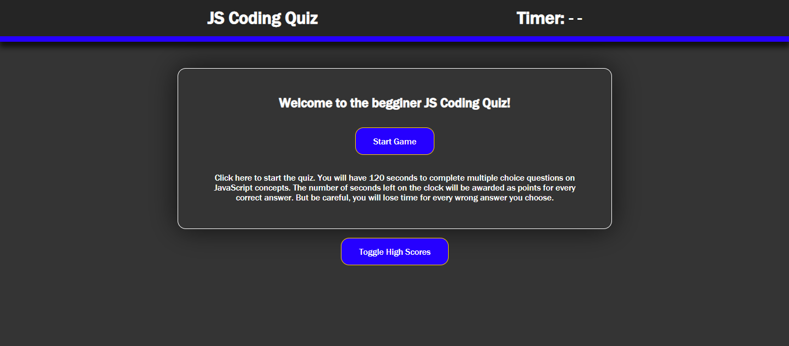
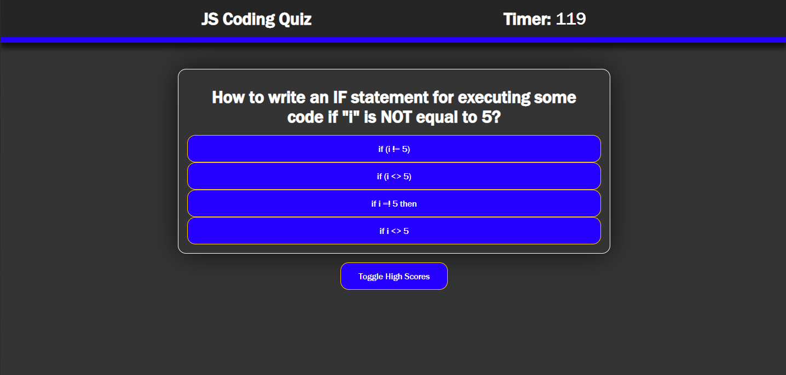
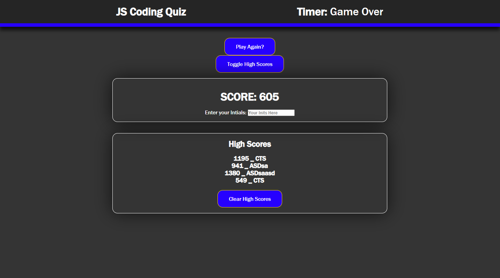

# JS-Begginer-Concept-Quiz_001
Short multiple choice question game to answer questions about javascript built in JS.

The deployed application can be found here: https://koxuvar.github.io/JS-Begginer-Concept-Quiz_001/

## !For Learning purposes only. The answers are available directly in the attached script.js file and easily readible!

## Description

The User is greeted by a welcome screen that explains the game and its parameters.
    * The game is 120 seconds long
    * Points are added based on the number of seconds left when the question is answered correctly
    * 10 seconds is taken off the timer when a question is answered incorrectly
    * the user may toggle on the high scores box at any time to see other players scores

Once the game starts the user is presented with a question and range of multiple choice answers. The user can then click on a given answer and either points will be awarded or time will be taken off the clock.

When the clock runs out or if the user answers all the quiz questions, the game ends and the users score is presented along with an input box to enter their initials. When the player submits their initials to the form, the score and initials are added to the high score leader board.

The high score leaderboard may be cleared at anytime.

## Screenshots

